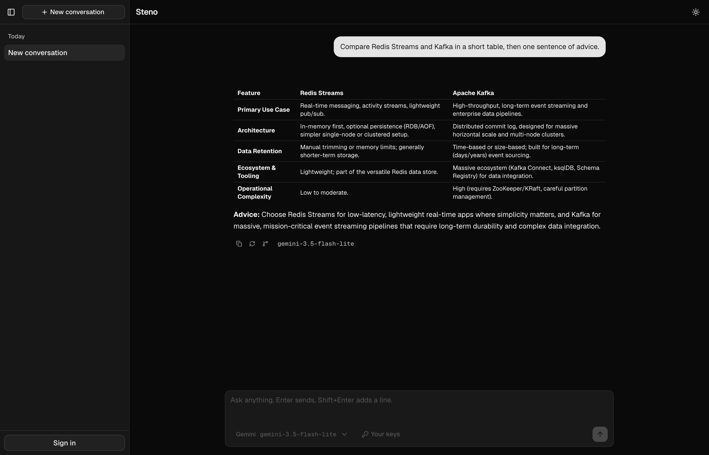
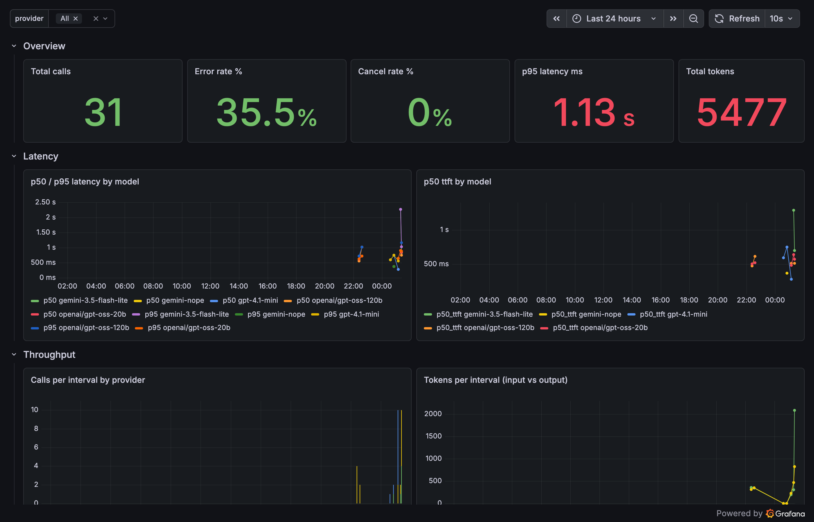
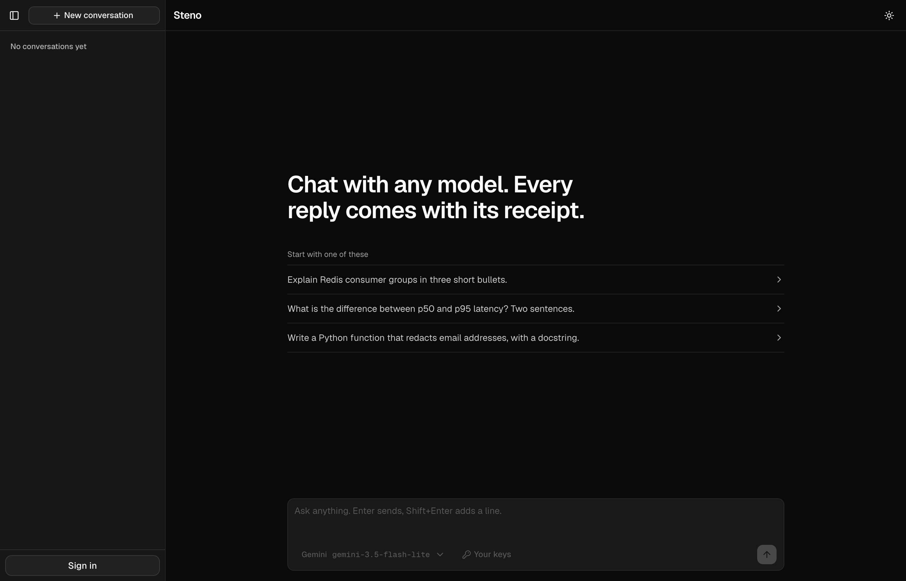
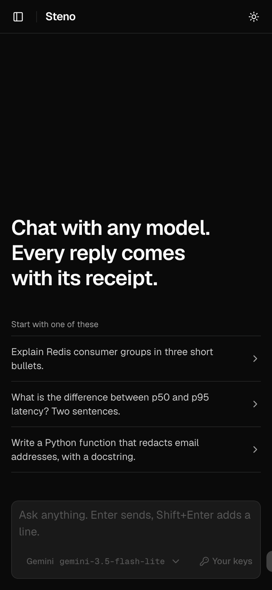

# steno

A small chatbot plus an auto-instrumenting SDK that logs every LLM call into
an event pipeline and Postgres, with Grafana dashboards on top. The SDK
patches httpx under the official provider SDKs, so no call site in the
chatbot knows it is being logged.

```
browser -> chat (FastAPI, streamed responses)
              |  official provider SDKs (google-genai / openai / anthropic; Groq rides the openai SDK)
              |  steno patches httpx underneath them: latency, ttft, tokens, previews, status
              v
           ingest (FastAPI)  --XADD-->  Redis stream  --XREADGROUP-->  worker  -->  Postgres  -->  Grafana
```

## Demo

Live at https://steno.tn07.dev. Sign-in is optional; conversations stay in the browser until you do.

| Chat | Dashboard |
|---|---|
|  |  |

| Welcome | Mobile |
|---|---|
|  |  |

## Quickstart

```sh
cp .env.example .env        # set at least one provider key, plus ADMIN_EMAILS and SESSION_SECRET
docker compose up --build
open http://localhost:8000       # chat UI
open http://localhost:3000/admin/  # Grafana dashboards, no login gate locally
```

## Layout

| Path | What |
|---|---|
| `steno/` | The SDK. `instrument()` patches `AsyncClient.send` on `httpx` and `httpx2` (the anthropic SDK's fork). `session(id)` tags calls with a conversation id via a ContextVar. Events batch in memory and flush to `STENO_ENDPOINT`. |
| `chat/` | Chatbot API (`main.py`), one streaming generator per provider (`providers.py`), identity and sessions (`auth.py`), the admin allowlist and the Caddy forward_auth check (`admin.py`), and the connection pool (`db.py`). Owns `users`, `admin_allowlist`, `conversations`, and `messages`. Serves the built `web/` UI as static files. |
| `web/` | React UI: Vite, TypeScript, Tailwind v4, shadcn (base-nova). `src/lib/api.ts` is the fetch layer, `src/lib/firebase.ts` the Firebase Auth config, `src/hooks/use-chat.ts` holds conversation and streaming state, `src/hooks/use-auth.ts` holds sign-in state, `src/components/*` one component per file. `/admin/access` edits who may open `/admin`. |
| `ingest/` | `main.py` validates a batch of events and appends to a Redis stream, returns 202. `worker.py` reads the stream with a consumer group and writes to Postgres, idempotent on `event_id`. |
| `chat/images.py` | Generated images: GCS bucket in production (`IMAGE_BUCKET`), inline data URI locally. |
| `db/` | `schema.sql`, the only schema definition. Five tables: `users`, `admin_allowlist`, `conversations`, `messages`, `inference_logs`. Decisions live in its comments. |
| `grafana/` | Provisioned datasource (reads Postgres directly) and the `Inference` dashboard. |
| `deploy/` | Production compose overlay, the Caddyfile, VM startup script, and the deploy script for a single free-tier GCE instance. |

## Identity and admin access

Anonymous visitors get an HttpOnly `uid` cookie and conversations are
scoped to it; there is nothing to sign up for. "Sign in with Google"
(Firebase Auth) posts an ID token to `POST /api/auth/session`, which
verifies it, upserts `users`, moves that browser's anonymous conversations
onto the account, and sets a signed `session` cookie. Forking a
conversation needs a signed-in viewer; everything else works anonymously.

`/admin` (Grafana) has a separate gate: Caddy calls `GET /api/admin/check`
before proxying anything under `/admin`, which passes allowlisted emails
through and redirects or 403s everyone else. The allowlist
(`admin_allowlist`) is seeded from `ADMIN_EMAILS` and edited at
`/admin/access`. See `ARCHITECTURE.md` for both flows in full.

## Using the SDK in your own app

```python
import steno
steno.instrument("http://ingest:8001/v1/logs")

with steno.session(conversation_id):
    ...  # any google-genai / openai / anthropic call, streaming or not
```

Nothing else changes. The SDK only looks at requests whose host matches a
known provider and whose path looks like an inference call; everything else
passes through untouched.

## Limits

The chat is free and public, so it is capped. Per IP: 10 messages a minute. Per identity per 24 hours: visitors
20 messages and 60k tokens, signed-in users 100 messages and 400k tokens (`BURST_PER_MINUTE`, `DAILY_*` in
`.env`). Requests on a visitor's own API key skip the daily caps. Rejections are stored in `quota_hits` and
charted on the dashboard's Usage row next to messages and tokens per user.

## Tradeoffs

- Instrumentation at the httpx layer under the official SDKs, not a wrapper per SDK: one parser for four wire formats, zero logging code at call sites, and it also catches `httpx2`, the fork the Anthropic SDK moved to.
- Previews, not full prompts, in the log store. Redacted and capped at 300 characters. Full text lives in `messages`, which the chat app owns.
- Redis Streams over Kafka or Pub/Sub: one container, consumer groups for horizontal workers, and it keeps `docker compose up` a single command.
- Grafana reads Postgres directly. No Prometheus and no metrics code; the tradeoff is that panel queries compete with the worker once the table is large.
- One free-tier VM, and the chat host is not behind Cloudflare: measured from India, Cloudflare's Mumbai to us-central1 path stalled 5 to 17 s on 40 percent of requests, the raw path did not. Cost of that: no DDoS shield in front of the chat.
- The SDK drops events after three failed flushes. Nothing blocks the user's request; an ingest outage loses telemetry, not chats.

## With more time

Persist and retry the SDK's dropped batches; expose the drop counter and the ingest reject count as metrics; a price table per model so the Usage row shows money, not tokens; partition `inference_logs` by `started_at` before retention deletes get expensive; integration tests for the ingest path; message attachments. Details and reasoning in `ARCHITECTURE.md`.

## Tests

```sh
python -m pytest -q
```

Covers response parsing for each provider's wire format (Google, Anthropic,
OpenAI, Groq) and the PII redaction regexes.

## Bonus checklist (from the assignment)

| Item | Status |
|---|---|
| Multi-provider | Done: Gemini and Groq (open-weight) with server keys; OpenAI and Anthropic with the visitor's own key, entered in the UI, kept in the browser, sent per request, never stored. |
| Streaming | Done, for all four providers. |
| Latency / throughput / error dashboards | Done, Grafana reading Postgres directly. |
| Docker Compose, one command | Done: `docker compose up --build`. |
| Event based | Done: Redis Streams with a consumer group, not a direct DB write from ingest. |
| PII redaction | Done: regex redaction on preview fields only; full prompts are never stored. |
| Cancel / list / resume conversations | Done: abort mid-stream saves the partial answer so the conversation can continue. Also done: rename, archive, branch (fork, sign-in required), and export as Markdown. |
| Self-hosted Kubernetes | Not done. One free-tier VM with Compose is the cheapest correct deployment at this traffic; Kubernetes adds operational cost with no benefit at this scale. |

See `ARCHITECTURE.md` for the full ingestion flow, schema reasoning, scaling
considerations, and failure handling assumptions.

## Deploy

A push to `main` builds the image in GitHub Actions and publishes it to Artifact
Registry (`.github/workflows/deploy.yml`, auth by Workload Identity Federation, no
stored secrets). On the VM, `deploy/steno-pull.timer` pulls the new image every two
minutes and restarts what changed. Nothing is built on the VM. `deploy/deploy.sh`
ships only config (`docker-compose.yml`, `deploy/`, `db/`, `grafana/`, `.env`) and
is needed only when those change. `.env.prod` holds the provider keys, `PUBLIC_HOST`,
`ADMIN_EMAILS` and `SESSION_SECRET`.

## Dashboards

Grafana reads `inference_logs` directly (no Prometheus) at http://localhost:3000/admin/.
The `Inference` dashboard has five rows: Overview (call count, error and cancel
rate, p95 latency, total tokens), Latency (p50/p95 latency and ttft by model),
Throughput (calls and tokens per interval), Errors (error/cancel counts and a
table of recent failures), and Recent (last 50 calls with previews).
Anonymous Viewer access is on in Grafana itself; Caddy's `forward_auth`
check is what keeps anyone but an allowlisted, signed-in email from ever
reaching it (see Identity and admin access above).
